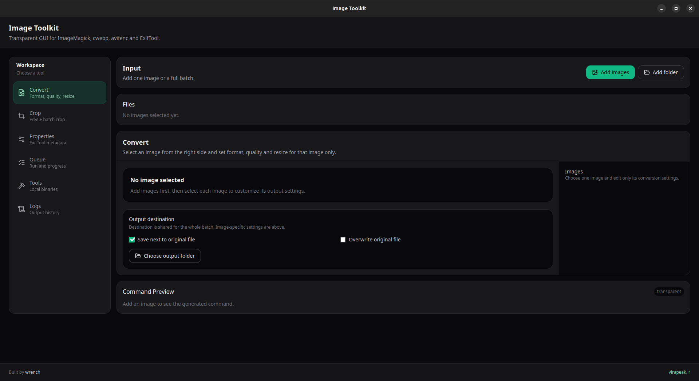

<div align="center">

# 🖼️ ایمیج تولکیت | Image Toolkit

### یک اپ دسکتاپ سریع، لوکال و شفاف برای تبدیل، تغییر سایز، فشرده‌سازی، کراپ و مدیریت متادیتای تصاویر.



<br/>

[](https://tauri.app/)
[](https://www.rust-lang.org/)
[](https://react.dev/)
[](https://www.typescriptlang.org/)
[](./LICENSE)

<br/>

[English](./README.md) · [TODO](./TODO.md) · [Repository](https://github.com/Aliazadi-1776/image-toolkit)

</div>

---

## ✨ ایمیج تولکیت چیست؟

**Image Toolkit** یک ابزار دسکتاپ لوکال برای پردازش تصاویر است؛ مناسب کسانی که با تعداد زیادی تصویر کار می‌کنند و می‌خواهند بدانند پشت رابط کاربری دقیقاً چه اتفاقی می‌افتد.

این برنامه یک تبدیل‌کننده آنلاین یا جعبه سیاه نیست.  
Image Toolkit یک رابط کاربری تمیز است که روی ابزارهای واقعی و شناخته‌شده مثل **ImageMagick**، **cwebp**، **avifenc** و **ExifTool** ساخته شده است.

تصاویر را انتخاب می‌کنی، فرمت خروجی را مشخص می‌کنی، کیفیت، فشرده‌سازی، تغییر سایز، کراپ و متادیتا را تنظیم می‌کنی و پردازش به صورت لوکال روی سیستم انجام می‌شود.

> ظاهر ساده، ابزار واقعی در پشت صحنه.

---

## ⚡ چرا ساخته شد؟

بیشتر ابزارهای تبدیل تصویر یا سنگین هستند، یا آنلاین کار می‌کنند، یا مشخص نیست دقیقاً چه کاری روی فایل انجام می‌دهند.

Image Toolkit ساخته شد تا این ویژگی‌ها را داشته باشد:

- لوکال و خصوصی
- شفاف و قابل فهم
- مناسب پردازش گروهی
- کاربردی برای کارهای واقعی تصویر
- قابل استفاده روی لینوکس و ویندوز
- ساخته‌شده روی ابزارهای واقعی CLI

---

## 🧰 قابلیت‌ها

- تبدیل گروهی تصاویر
- تنظیم خروجی جداگانه برای هر تصویر
- کراپ جداگانه برای هر تصویر
- تغییر سایز تصاویر
- کنترل فشرده‌سازی
- خروجی WebP
- خروجی AVIF
- پشتیبانی از PNG، JPEG، TIFF، BMP، GIF و ICO
- پاک‌سازی متادیتا
- نوشتن متادیتای پایه
- پردازش صف‌محور
- نمایش پیشرفت هر فایل
- نمایش لاگ پردازش
- پیش‌نمایش دستورها
- بررسی وضعیت ابزارهای داخلی
- خروجی لینوکس و ویندوز
- پردازش کاملاً لوکال

---

## 🖼️ فرمت‌های پشتیبانی‌شده

| فرمت | وضعیت |
|---|---|
| WebP | ✅ |
| AVIF | ✅ |
| PNG | ✅ |
| JPEG / JPG | ✅ |
| TIFF | ✅ |
| BMP | ✅ |
| GIF | ✅ |
| ICO | ✅ |

---

## 🧪 ابزارهای پشت برنامه

| ابزار | کاربرد |
|---|---|
| **ImageMagick** | تبدیل عمومی، تغییر سایز، کراپ و مدیریت فرمت‌ها |
| **cwebp** | ساخت خروجی WebP |
| **avifenc** | ساخت خروجی AVIF |
| **ExifTool** | نوشتن و پاک‌سازی متادیتا |

برنامه ابزارها را به این ترتیب پیدا می‌کند:

1. ابزارهای bundle شده داخل Tauri
2. پوشه توسعه `src-tauri/vendor`
3. ابزارهای نصب‌شده روی سیستم از طریق `PATH`

---

## 🖥️ پلتفرم‌ها

| سیستم عامل | خروجی |
|---|---|
| Linux | `.deb` |
| Linux | `.AppImage` |
| Windows | نصب‌کننده NSIS با پسوند `.exe` |
| macOS | برنامه آینده |

---

## 📸 تصویر برنامه

<div align="center">


</div>

---

## 🚀 اجرای پروژه از سورس

```bash
git clone https://github.com/Aliazadi-1776/image-toolkit.git
cd image-toolkit
npm install
